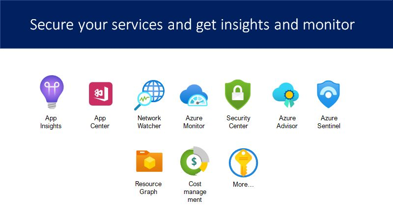

# AzureMonitor

This repository includes various samples and information how to use Azure Monitoring services and more. This collection will be extended from time to time.

## Why monitoring

Azure is huge!
Discover services that are unsafe, costs, or debug issues. Every service is for a specific purpose. Here´s a list of services that can help to get insights from your services running in Azure or in hybrid scenarios.

- **App Insights:** is a feature of Azure Monitor to monitor a SINGLE desktop or a web app
- **App Center:** Test apps and monitor and distribute a SINGLE app
- **Network Watcher:** troubleshoot VPN, inspect packages and more
- **Azure Monitor:** overall monitoring system = multiple apps
- **Security Center:** monitors all svc & suggests security improvements
- **Azure Advisor:** monitors all svc : security, but also performance, costs
- **Azure Sentinel:** like security center, but goes further
- **Resource Graph:** get current data from Azure Resource Manager
- **Graph Security Center:** get insights and reports from M365
- of course, there´s more...

## Samples

- **AppCenter-WinForm** a simple Win form app using App Center logging in a legacy app (WinForm, full .net framework)
- **AppInsights-AzureFunction** a sample how to use AppInsights in an Azure Function >=2.x (.NET Core)

## Links

### App Insights

- https://docs.microsoft.com/en-us/dotnet/api/microsoft.applicationinsights.extensibility.telemetryconfiguration.createdefault?view=azure-dotnet
- https://docs.microsoft.com/en-us/azure/azure-monitor/app/console
- https://docs.microsoft.com/en-us/azure/azure-monitor/app/javascript
- Using Azure Application Insights In PowerShell: https://www.c-sharpcorner.com/article/using-azure-application-insights-in-powershell/

### Azure Monitor

- Azure Monitor log query examples: https://docs.microsoft.com/en-us/azure/azure-monitor/logs/examples

### App Center

- App Center: https://appcenter.ms/apps
- https://docs.microsoft.com/en-us/appcenter/sdk/getting-started/wpf-winforms

### Misc

- Azure Friday, Azure Barry video: https://www.youtube.com/watch?v=Zr7LcSr6Ooo
- When to use what Azure monitoring service: https://blog.atwork.at/post/Monitor-overview-of-Azure-services

...more to come
